# Tutorial: Implementação de Somador Ponto Flutuante na DE10-Lite

**Autores:** Camila Lorena, Sofia Bortolazo, Victor Felippe Dias

**Disciplina:** Sistemas Digitais Q2.20026

**Data:** 07/08/2026

---
*Etapa 1*

## 1. Objetivo do Projeto

Este projeto adapta o somador de ponto flutuante simplificado (13 bits: 1 bit de sinal, 4 bits de expoente, 8 bits de fração) do livro-texto para a placa Terasic DE10-Lite (MAX 10). O objetivo é demonstrar a síntese lógica e a simulação de hardware utilizando a linguagem VHDL, partindo de um projeto teórico validado por simulação (GHDL/GTKWave) até o funcionamento físico na placa.

## 2. Descrição gráfica do funcionamento do sistema

O somador é organizado em 4 estágios combinacionais:

• 1º Estágio (Ordenação): O circuito compara quem é o maior número para decidir quem vai para os sinais 'b' (big) e 's' (small). Ele faz isso realizando a operação de comparação (\>) com o binário gerado pela concatenação do fracionário com o expoente.

• 2º Estágio (Alinhamento): Para somar as frações, os expoentes precisam ser iguais. O circuito desloca a fração menor para a direita com base na diferença dos expoentes (calcula exp_diff = expb − exps e desloca a fração).

• 3º Estágio (Soma/Subtração): Caso os sinais sejam iguais, é realizada a soma fracb + fraca; caso contrário, a subtração. É adicionado um '0' à esquerda das frações para transformá-las em 9 bits e não perder um possível carry-out.

• 4º Estágio (Normalização): O circuito precisa devolver o resultado para o formato de 8 bits na fração, garantindo que o bit mais significativo seja '1'. Conta os zeros à esquerda do resultado (leado) e desloca a fração para a esquerda essa quantidade de posições, ajustando o expoente. Trata dois casos especiais: carry out (sum(8)='1', desloca à direita e soma 1 ao expoente) e underflow (leado \> expb, resultado zerado).

Abaixo, o código original com os comentários de como são divididos as estágios descritos e o entendimento do grupo do que cada um faz nas linhas de código comentadas:

```vhdl
library ieee;
use ieee.std_logic_1164.all;
use ieee.numeric_std.all;
entity fp_adder is
port (
-- Entradas divididas em sinal (1 bit), expoente (4 bits) e fração/significando (8 bits)
sign1, sign2: in std_logic;
exp1, exp2: in std_logic_vector (3 downto 0);
frac1, frac2: in std_logic_vector(7 downto 0);
-- Saídas com o mesmo formato das entradas
sign_out: out std_logic;
exp_out: out std_logic_vector (3 downto 0);
frac_out: out std_logic_vector(7 downto 0)
);
end fp_adder;
architecture arch of fp_adder is
-- As variáveis intermediárias utilizam um padrão de nomenclatura para identificar as etapas:
-- 'b' = big (maior), 's' = small (menor), 'a' = aligned (alinhado), 'n' = normalized (normalizado)
signal signb, signs: std_logic;
signal expb, exps, expn: unsigned (3 downto 0);
signal fracb, fracs, fraca, fracn: unsigned (7 downto 0);
signal sum_norm: unsigned (7 downto 0);
signal exp_diff: unsigned (3 downto 0);
-- O sinal 'sum' possui 9 bits (um a mais que a fração) para casos em que acontece o 'carry-out' (vai-um)
signal sum: unsigned (8 downto 0);
signal leado: unsigned (2 downto 0);
begin
-- =====================================================================
-- 1º PASSO: ORDENAÇÃO (Descobrir qual número é o maior e alocar nas variáveis correspondentes)
process (sign1, sign2, exp1, exp2, frac1, frac2)
begin
-- Concatena o expoente com a fração para comparar os tamanhos, com o expoente tendo mais peso
if (exp1 & frac1) > (exp2 & frac2) then
signb <= sign1;
signs <= sign2;
expb <= unsigned(exp1);
exps <= unsigned(exp2);
fracb <= unsigned(frac1);
fracs <= unsigned(frac2);
else
signb <= sign2;
signs <= sign1;
expb <= unsigned(exp2);
exps <= unsigned(exp1);
fracb <= unsigned(frac2);
fracs <= unsigned(frac1);
end if;
end process;
-- =====================================================================
-- 2º PASSO: ALINHAMENTO (Igualar os expoentes para poder somar)
-- =====================================================================
-- Calcula a diferença entre o expoente maior e o menor
exp_diff <= expb - exps;
-- Desloca a fração do número menor para a direita com base na diferença de expoentes
-- A cada deslocamento, insere um '0' à esquerda e descarta o bit menos significativo à direita
with exp_diff select
fraca <=
fracs when "0000",
"0" & fracs(7 downto 1) when "0001",
"00" & fracs(7 downto 2) when "0010",
"000" & fracs(7 downto 3) when "0011",
"0000" & fracs(7 downto 4) when "0100",
"00000" & fracs(7 downto 5) when "0101",
"000000" & fracs(7 downto 6) when "0110",
"0000000" & fracs(7) when "0111",
"00000000" when others; -- Diferença muito grande zera a fração menor
-- =====================================================================
-- 3º PASSO: ADIÇÃO / SUBTRAÇÃO
-- =====================================================================
-- Concatena um '0' à esquerda para transformar 8 bits em 9 bits (para caber o carry-out)
-- Soma se os sinais forem iguais, subtrai se forem diferentes
sum <= ('0' & fracb) + ('0' & fraca) when signb = signs else
('0' & fracb) - ('0' & fraca);
-- =====================================================================
-- 4º PASSO: NORMALIZAÇÃO (Ajustar o resultado final)
-- =====================================================================
-- Passo 4.1: Contar a quantidade de Zeros à esquerda no resultado
-- Analisa cada bit da soma (exceto o bit 8 do carry) como um codificador de prioridade
leado <=
"000" when (sum(7)='1') else
"001" when (sum(6)='1') else
"010" when (sum(5)='1') else
"011" when (sum(4)='1') else
"100" when (sum(3)='1') else
"101" when (sum(2)='1') else
"110" when (sum(1)='1') else
"111";
-- Passo 4.2: Deslocar a fração para a esquerda eliminando os zeros contabilizados
-- Isso garante que o bit mais significativo seja '1' (formato normalizado)
with leado select
sum_norm <=
sum(7 downto 0) when "000",
sum(6 downto 0) & '0' when "001",
sum(5 downto 0) & "00" when "010",
sum(4 downto 0) & "000" when "011",
sum(3 downto 0) & "0000" when "100",
sum(2 downto 0) & "00000" when "101",
sum(1 downto 0) & "000000" when "110",
sum(0) & "0000000" when others;
-- Passo 4.3: Ajustes finais de Expoente e Fração considerando exceções
process (sum, sum_norm, expb, leado)
begin
-- Condição 1: Houve Carry-out na soma (estourou o limite)
if sum(8)='1' then
expn <= expb + 1; -- Aumenta o expoente em 1
fracn <= sum(8 downto 1); -- Desloca a fração toda para a direita para acomodar o bit extra
-- Condição 2: Underflow (número muito pequeno para ser normalizado)
elsif (leado > expb) then
expn <= (others => '0'); -- Zera o expoente
fracn <= (others => '0'); -- Zera a fração
-- Condição 3: Situação normal (Sem carry-out e sem underflow)
else
expn <= expb - leado; -- Subtrai do expoente a quantidade de casas deslocadas
fracn <= sum_norm; -- Usa a fração normalizada do passo anterior
end if;
end process;
-- =====================================================================
-- SAÍDA DO MÓDULO (Atribuição dos sinais internos às portas de saída)
-- =====================================================================
sign_out <= signb; -- O sinal do resultado final é sempre o sinal do número maior
exp_out <= std_logic_vector(expn); -- Converte de volta para std_logic_vector
frac_out <= std_logic_vector(fracn);
end arch;
```

**Exemplo de operação:** 540 - 8700 = -8160

Convertendo para binário, temos:

1000011100 - 10000111111100

Agora, para deixar em formato de 13 bits, utilizamos o primeiro bit para o sinal (0 positivo, 1 negativo), os primeiro 8 bits mais significantes para o fracionário e o número de bits restantes em um binário de 4 bits, obtendo:

0 10000111 0010

1 10000111 0110

Etapa 1: Ordenar os números, em ordem crescente, considerando também o expoente e desconsiderando o sinal (módulo)

1 10000111 0110

0 10000111 0010

Etapa 2: Alinhar os coeficiente (o que significa deslocar o fracionário do número com menor coeficiente, desconsiderando o sinal, para a direita uma vez a cada unidade aumentada no expoente)

1 10000111 0110

0 00001000 0110

Etapa 3: Realizar a soma/subtração dos fracionários

\- 10000111

<u>+ 00001000</u>

\- 01111111

Etapa 4: Alinhar o fracionário do resultado deslocando o número para a esquerda até que o primeiro bit seja 1 (em outras palavras, realizar multiplicações por 2, ou, ainda, deslocar até que o decimal correspondente seja \>=128)

-01111111

-11111110

Etapa 5: Resultado final, mantendo o sinal do maior número em módulo e já subtraindo do expoente o número de casas descoladas do passo anterior

1 11111110 0101

Ou

-254. 2^5 = -8.128

Aqui, o resultado final não é exato devido aos arredondamentos realizados durante a conversão, o alinhamento e a normalização.

**Código do testbench realizado**

```vhdl
library ieee;
use ieee.std_logic_1164.all;
use ieee.numeric_std.all;
entity fp_adder_test is
end fp_adder_test;
architecture sim of fp_adder_test is
-- Entrada
signal sign1, sign2 : std_logic := '0';
signal exp1, exp2 : std_logic_vector (3 downto 0) := (others => '0');
signal frac1, frac2 : std_logic_vector (7 downto 0) := (others => '0');
-- Saída
signal sign_out : std_logic;
signal exp_out : std_logic_vector (3 downto 0);
signal frac_out : std_logic_vector (7 downto 0);
begin
- Associação das variáveis do código original com as entradas do testbench.
uut: entity work.fp_adder
port map (
sign1 => sign1,
sign2 => sign2,
exp1 => exp1,
exp2 => exp2,
frac1 => frac1,
frac2 => frac2,
sign_out => sign_out,
exp_out => exp_out,
frac_out => frac_out
);
-- Testes de cálculos
stimulus_process: process
begin
-- Caso 1
sign1 <= '0';
exp1 <= "0011";
frac1 <= "00110110";
sign2 <= '1';
exp2 <= "0100";
frac2 <= "01010111";
wait for 100 ns;
-- Caso 2
sign1 <= '0';
exp1 <= "1010";
frac1 <= "11110000";
sign2 <= '1';
exp2 <= "1001";
frac2 <= "10110000";
wait for 100 ns;
-- Caso 3
sign1 <= '1';
exp1 <= "0111";
frac1 <= "11000000";
sign2 <= '1';
exp2 <= "0111";
frac2 <= "10000000";
wait for 100 ns;
wait;
end process;
end sim;
```

**Captura de tela fp_adder_test.vhd no GTKWave**

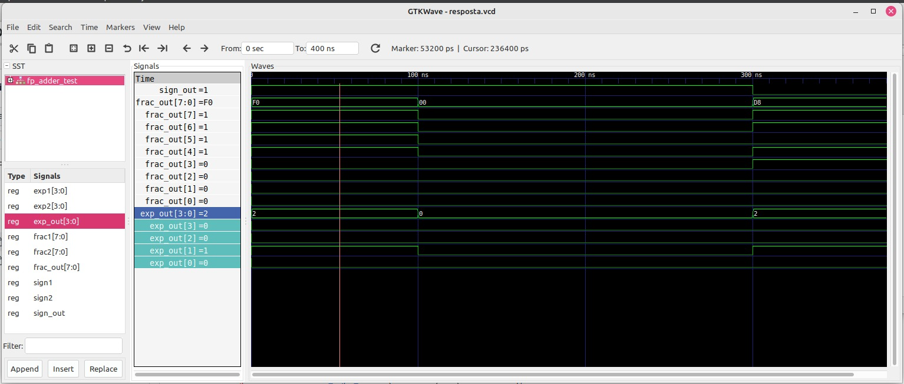

*Etapa 2*

## 3. Adaptações de Hardware (DE10-Lite)

### O que mudamos no VHDL original:

Para a utilização do somador binário na placa disponível para o projeto (DE10-Lite), as maiores adaptações foram a forma de leitura de dados, utilizando os switches e botões disponíveis na placa utilizada, e a saída da soma final, utilizando os displays de 7 segmentos.

A DE10-Lite conta com 10 switches, 2 botões e 6 displays de 7 segmentos. Dessa forma, dividimos a captura dos dados em 4 etapas, que são controladas por uma variável contadora:

- Primeira etapa: inclusão do sinal e do fracionário do primeiro número nos primeiros 9 switches da placa (da esquerda para direita). Os dados são confirmados ao apertar o botão.

- Segunda etapa: inclusão do expoente do primeiro número nos primeiros 4 switches da placa (da esquerda para a direita). Os dados são confirmados ao apertar o botão.

- Terceira etapa: inclusão do sinal e do fracionário do segundo número nos primeiros 9 switches da placa (da esquerda para direita). Os dados são confirmados ao apertar o botão.

- Quarta etapa: inclusão do expoente do segundo número nos primeiros 4 switches da placa (da esquerda para a direita). Os dados são confirmados ao apertar o botão.

Entre as etapas, os leds vermelhos localizados acima dos switches acendem indicando a confirmação da inserção.

Além disso, setamos o segundo botão disponível como um reset do processo, permitindo iniciar do zero em caso de erros de inserção.

A cada etapa os valores inseridos são armazenados nas variáveis de entrada sign1, frac1, exp1, sign2, frac2 e exp2, que seguem para o restante do código com a lógica de soma original.

A seguir, o bloco de código adicionado para a captura das entradas:

```vhdl
begin
process(ADC_CLK_10)
begin
if rising_edge(ADC_CLK_10) then
key0_r1 <= KEY(0);
key0_r2 <= key0_r1;
end if;
end process;
key0_pulse <= '1' when key0_r2 = '1' and key0_r1 = '0' else '0';
process (ADC_CLK_10)
begin
if rising_edge(ADC_CLK_10) then –captura as entradas somente na borda de subida do clock, evitando a identificação constante do botão
if (KEY(1)='0') then
sign1 <= '0'; sign2 <= '0';
frac1 <= (others => '0'); frac2 <= (others => '0');
exp1 <= (others => '0'); exp2 <= (others => '0');
contador <= 0; LEDR <= "0000";
elsif (key0_pulse = '1') then
case contador is
when 0 =>
sign1 <= SW(9);
frac1 <= unsigned(SW(8 downto 1));
contador <= 1; LEDR <= "0001";
when 1 =>
exp1 <= unsigned(SW(9 downto 6));
contador <= 2; LEDR <= "0010";
when 2 =>
sign2 <= SW(9);
frac2 <= unsigned(SW(8 downto 1));
contador <= 3; LEDR <= "0100";
when 3 =>
exp2 <= unsigned(SW(9 downto 6));
contador <= 0; LEDR <= "1000";
when others =>
contador <= 0;
end case;
end if;
end if;
end process;
```

Para a impressão do resultado final, adaptamos para que os displays de 7 segmentos fossem utilizados, imprimindo:

- No primeiro display, o sinal. É impresso o caractere “-” para resultados negativos e um espaço vazio para positivos.

- Nos três próximos display, o fracionário de 8 bits em base decimal, podendo ir de 000 a 255.

- Nos dois últimos displays, o expoente de 4 bits em base decimal, podendo ir de 00 a 15.

A seguir, o bloco de código adicionado para a saída dos resultados:

```vhdl
–Função que decodifica cada binário de 4 dígitos (de 0 a 9) para a saída do display de 7 segmentos, onde 0 representa o segmento aceso e 1 o segmento apagado.
function decode_7seg(hex_val : unsigned(3 downto 0)) return std_logic_vector is
begin
case hex_val is
when "0000" => return "1000000";
when "0001" => return "1111001";
when "0010" => return "0100100";
when "0011" => return "0110000";
when "0100" => return "0011001";
when "0101" => return "0010010";
when "0110" => return "0000010";
when "0111" => return "1111000";
when "1000" => return "0000000";
when "1001" => return "0010000";
when others => return "1111111";
end case;
end function;
–Aplicação da função no inteiro, dividido em centena, dezena e unidade
process(fracn, expn)
variable f_int : integer range 0 to 255;
variable e_int : integer range 0 to 15;
begin
f_int := to_integer(fracn);
e_int := to_integer(expn);
exp_dez <= to_unsigned(e_int / 10, 4);
exp_uni <= to_unsigned(e_int mod 10, 4);
frac_cen <= to_unsigned(f_int / 100, 4);
frac_dez <= to_unsigned((f_int mod 100) / 10, 4);
frac_uni <= to_unsigned(f_int mod 10, 4);
end process;
sign_out <= signb;
exp_out <= std_logic_vector(expn);
frac_out <= std_logic_vector(fracn);
with signb select HEX5 <=
"1111111" when '0',
"0111111" when '1',
"1111111" when others;
HEX4 <= decode_7seg(frac_cen);
HEX3 <= decode_7seg(frac_dez);
HEX2 <= decode_7seg(frac_uni);
HEX1 <= decode_7seg(exp_dez);
HEX0 <= decode_7seg(exp_uni);
```

## 4. Evidências de Validação

### Simulação

Ao realizar a simulação no GTKWave, conseguimos obter o mesmo resultado final obtido no testbench do código original, apenas com algumas etapas a mais de impressão devido a dinâmica de inserção de dados do código adaptado.

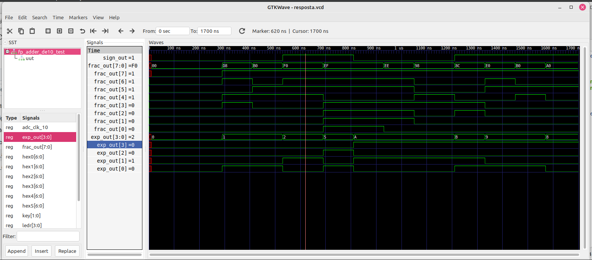

Código do teste, gerado com o Claude Code:

```vhdl
library ieee;
use ieee.std_logic_1164.all;
use ieee.numeric_std.all;
-- Testbench para fp_adder_de10_v1
-- Requer VHDL-2008 (usa "while" na declaração de processo e outras
-- construções modernas). expn e fracn (internos do DUT) são vistos
-- diretamente no GTKWave, sem necessidade de portas extras.
entity fp_adder_test is
end fp_adder_test;
architecture sim of fp_adder_test is
-- Sinais de interface com o DUT (equivalentes às entradas físicas da DE10)
signal ADC_CLK_10 : std_logic := '0';
signal SW : std_logic_vector (9 downto 0) := (others => '0');
signal KEY : std_logic_vector (1 downto 0) := (others => '1'); -- '1' = solto
-- Saídas do DUT
signal sign_out : std_logic;
signal exp_out : std_logic_vector (3 downto 0);
signal frac_out : std_logic_vector (7 downto 0);
signal HEX0, HEX1, HEX2, HEX3, HEX4, HEX5 : std_logic_vector (6 downto 0);
signal LEDR : std_logic_vector (3 downto 0);
constant CLK_PERIOD : time := 20 ns;
-- Flag usada para encerrar o processo de clock quando os testes acabarem,
-- evitando que a simulação rode para sempre (o clk_process, sozinho,
-- geraria bordas indefinidamente).
signal sim_finished : boolean := false;
begin
-- Associação das variáveis do código original com as entradas do testbench.
uut: entity work.fp_adder_de10_v1
port map (
ADC_CLK_10 => ADC_CLK_10,
SW => SW,
KEY => KEY,
sign_out => sign_out,
exp_out => exp_out,
frac_out => frac_out,
HEX0 => HEX0,
HEX1 => HEX1,
HEX2 => HEX2,
HEX3 => HEX3,
HEX4 => HEX4,
HEX5 => HEX5,
LEDR => LEDR
);
-- Geração do clock
clk_process: process
begin
while not sim_finished loop
ADC_CLK_10 <= '0';
wait for CLK_PERIOD / 2;
ADC_CLK_10 <= '1';
wait for CLK_PERIOD / 2;
end loop;
wait; -- suspende definitivamente, encerrando a simulação
end process;
-- Testes de cálculos
stimulus_process: process
-- Simula um clique no botão KEY(0), respeitando o sincronismo de
-- 2 flip-flops usado no DUT para detectar a borda de descida.
procedure press_key0 is
begin
wait until rising_edge(ADC_CLK_10);
KEY(0) <= '0';
wait for 3 * CLK_PERIOD;
KEY(0) <= '1';
wait for 3 * CLK_PERIOD;
end procedure;
-- Carrega um operando completo (sinal + fração, depois expoente),
-- reproduzindo os 2 passos que o usuário faria com as chaves SW.
procedure load_operand(sign_bit : std_logic;
frac_bits : std_logic_vector (7 downto 0);
exp_bits : std_logic_vector (3 downto 0)) is
begin
SW(9) <= sign_bit;
SW(8 downto 1) <= frac_bits;
press_key0;
SW(9 downto 6) <= exp_bits;
press_key0;
end procedure;
-- Carrega os dois operandos de um caso de teste e imprime os
-- resultados, incluindo os sinais intermediários expn e fracn.
procedure run_case(caseName : string;
sign1v : std_logic; exp1v : std_logic_vector (3 downto 0); frac1v : std_logic_vector (7 downto 0);
sign2v : std_logic; exp2v : std_logic_vector (3 downto 0); frac2v : std_logic_vector (7 downto 0)) is
begin
report "==== " & caseName & " ====";
load_operand(sign1v, frac1v, exp1v);
load_operand(sign2v, frac2v, exp2v);
wait for 2 * CLK_PERIOD; -- aguarda a lógica combinacional estabilizar
-- expn e fracn (sinais internos do DUT) podem ser conferidos
-- aqui neste instante de tempo diretamente no GTKWave,
-- em uut/expn e uut/fracn.
report "sign_out = " & std_logic'image(sign_out);
report "exp_out = " & integer'image(to_integer(unsigned(exp_out)));
report "frac_out = " & integer'image(to_integer(unsigned(frac_out)));
end procedure;
begin
-- Reset inicial (KEY(1) = '0' limpa os registradores internos)
KEY(1) <= '0';
wait for 4 * CLK_PERIOD;
KEY(1) <= '1';
wait for 2 * CLK_PERIOD;
-- Caso 1
run_case("Caso 1",
'0', "0011", "00110110",
'1', "0100", "01010111");
-- Caso 2
run_case("Caso 2",
'0', "1010", "11110000",
'1', "1001", "10110000");
-- Caso 3
run_case("Caso 3",
'1', "0111", "11000000",
'1', "0111", "10000000");
report "Testes concluidos.";
sim_finished <= true;
wait;
end process;
end sim;
```

No vídeo gravado em laboratório, realizamos o teste de alguns casos especiais como o underflow, overflow, arredondamento para 0 e casos em que ocorre a normalização do primeiro bit. Na seção a seguir, descrevemos os testes realizados com mais detalhes e imagens.

### Código VHDL Final

```vhdl
library ieee;
use ieee.std_logic_1164.all;
use ieee.numeric_std.all;
--- ADAPTAÇÃO DE10-LITE: A entidade agora unifica o somador aritmético e a
--- interface de hardware (placa DE10-Lite) em um único módulo.
--- Foram adicionados o clock da placa (ADC_CLK_10), as 10 chaves (SW),
--- 2 botões (KEY), os 6 displays de 7 segmentos (HEX0 a HEX5) e os LEDs.
entity fp_adder_de10_v1 is
port (
ADC_CLK_10 : in std_logic;
SW : in std_logic_vector (9 downto 0);
KEY : in std_logic_vector (1 downto 0);
sign_out : out std_logic;
exp_out : out std_logic_vector (3 downto 0);
frac_out : out std_logic_vector (7 downto 0);
HEX0 : out std_logic_vector (6 downto 0);
HEX1 : out std_logic_vector (6 downto 0);
HEX2 : out std_logic_vector (6 downto 0);
HEX3 : out std_logic_vector (6 downto 0);
HEX4 : out std_logic_vector (6 downto 0);
HEX5 : out std_logic_vector (6 downto 0);
LEDR : out std_logic_vector (3 downto 0)
);
end fp_adder_de10_v1;
architecture arch of fp_adder_de10_v1 is
--- ADAPTAÇÃO DE10-LITE: Variável para controlar a máquina de estados
--- sequencial que fará a leitura das chaves em 4 etapas.
signal contador : integer range 0 to 3 := 0;
-- Sinais originais do núcleo do somador mantidos
signal signb, signs, sign1, sign2 : std_logic;
signal expb, exps, expn, exp1, exp2 : unsigned (3 downto 0);
signal fracb, fracs, fraca, fracn, frac1, frac2 : unsigned (7 downto 0);
signal sum_norm : unsigned (7 downto 0);
signal exp_diff : unsigned (3 downto 0);
signal sum : unsigned (8 downto 0);
signal leado : unsigned (2 downto 0);
--- ADAPTAÇÃO DE10-LITE: Sinais para criar um "detector de borda" (edge detector)
--- para garantir que um toque no botão KEY(0) conte apenas uma vez.
signal key0_r1, key0_r2 : std_logic := '1';
signal key0_pulse : std_logic;
--- ADAPTAÇÃO DE10-LITE: Sinais para armazenar os valores convertidos
--- de binário puro para decimal (BCD - Binary Coded Decimal).
signal exp_dez, exp_uni : unsigned(3 downto 0);
signal frac_cen, frac_dez, frac_uni : unsigned(3 downto 0);
--- ADAPTAÇÃO DE10-LITE: Função interna criada para decodificar os valores
--- para os displays de 7 segmentos. Isso elimina a necessidade de instanciar
--- um componente externo (hex_to_sseg) como era feito no livro.
function decode_7seg(hex_val : unsigned(3 downto 0)) return std_logic_vector is
begin
case hex_val is
when "0000" => return "1000000";
when "0001" => return "1111001";
when "0010" => return "0100100";
when "0011" => return "0110000";
when "0100" => return "0011001";
when "0101" => return "0010010";
when "0110" => return "0000010";
when "0111" => return "1111000";
when "1000" => return "0000000";
when "1001" => return "0010000";
when others => return "1111111";
end case;
end function;
begin
--- ADAPTAÇÃO DE10-LITE: Processo sequencial atrelado ao clock da placa
--- para registrar o estado do botão KEY(0) e gerar um pulso único (key0_pulse).
process(ADC_CLK_10)
begin
if rising_edge(ADC_CLK_10) then
key0_r1 <= KEY(0);
key0_r2 <= key0_r1;
end if;
end process;
key0_pulse <= '1' when key0_r2 = '1' and key0_r1 = '0' else '0';
--- ADAPTAÇÃO DE10-LITE: Máquina de estados (Multiplexação no Tempo de Entrada).
--- Como a placa não tem 26 chaves para ler todos os operandos de uma vez (como o código original exigia),
--- esse processo usa as 10 chaves (SW) em 4 rodadas de leitura.
process (ADC_CLK_10)
begin
if rising_edge(ADC_CLK_10) then
-- KEY(1) atua como um botão de Reset geral para o sistema.
if (KEY(1)='0') then
sign1 <= '0'; sign2 <= '0';
frac1 <= (others => '0'); frac2 <= (others => '0');
exp1 <= (others => '0'); exp2 <= (others => '0');
contador <= 0; LEDR <= "0000";
elsif (key0_pulse = '1') then
case contador is
when 0 => -- Lê Sinal 1 e Fração 1
sign1 <= SW(9);
frac1 <= unsigned(SW(8 downto 1));
contador <= 1; LEDR <= "0001"; -- Acende LED para indicar estado
when 1 => -- Lê Expoente 1
exp1 <= unsigned(SW(9 downto 6));
contador <= 2; LEDR <= "0010";
when 2 => -- Lê Sinal 2 e Fração 2
sign2 <= SW(9);
frac2 <= unsigned(SW(8 downto 1));
contador <= 3; LEDR <= "0100";
when 3 => -- Lê Expoente 2
exp2 <= unsigned(SW(9 downto 6));
contador <= 0; LEDR <= "1000";
when others =>
contador <= 0;
end case;
end if;
end if;
end process;
-----------------------------------------------------------------------------------------------------------------
--- NÚCLEO DO SOMADOR ORIGINAL MANTIDO DAQUI ATÉ O FIM DO CÁLCULO
-----------------------------------------------------------------------------------------------------------------
-- 1º estágio: ordena para encontrar o maior número
process (exp1, frac1, exp2, frac2, sign1, sign2)
begin
if (exp1 & frac1) > (exp2 & frac2) then
signb <= sign1; signs <= sign2; expb <= exp1; exps <= exp2; fracb <= frac1; fracs <= frac2;
else
signb <= sign2; signs <= sign1; expb <= exp2; exps <= exp1; fracb <= frac2; fracs <= frac1;
end if;
end process;
-- 2º estágio: alinha o número menor
exp_diff <= expb - exps;
with exp_diff select fraca <=
fracs when "0000",
"0" & fracs (7 downto 1) when "0001",
"00" & fracs (7 downto 2) when "0010",
"000" & fracs (7 downto 3) when "0011",
"0000" & fracs (7 downto 4) when "0100",
"00000" & fracs (7 downto 5) when "0101",
"000000" & fracs (7 downto 6) when "0110",
"0000000" & fracs (7) when "0111",
"00000000" when others;
-- 3º estágio: soma/subtração
sum <= ('0' & fracb) + ('0' & fraca) when signb = signs else
('0' & fracb) - ('0' & fraca);
-- 4º estágio: normalização e contagem de zeros à esquerda
leado <= "000" when (sum(7) = '1') else
"001" when (sum(6) = '1') else
"010" when (sum(5) = '1') else
"011" when (sum(4) = '1') else
"100" when (sum(3) = '1') else
"101" when (sum(2) = '1') else
"110" when (sum(1) = '1') else
"111";
-- desloca a mantissa de acordo com o zero principal
with leado select sum_norm <=
sum(7 downto 0) when "000",
sum(6 downto 0) & '0' when "001",
sum(5 downto 0) & "00" when "010",
sum(4 downto 0) & "000" when "011",
sum(3 downto 0) & "0000" when "100",
sum(2 downto 0) & "00000" when "101",
sum(1 downto 0) & "000000" when "110",
sum(0) & "0000000" when others;
-- Trata condições especiais (estouro/muito pequeno)
process (sum, sum_norm, expb, leado)
begin
if sum(8) = '1' then
expn <= expb + 1;
fracn <= sum(8 downto 1);
elsif (leado > expb) then
expn <= (others => '0');
fracn <= (others => '0');
else
expn <= expb - leado;
fracn <= sum_norm;
end if;
end process;
-------------------------------------------------------------------
--- FIM DO NÚCLEO DO SOMADOR ORIGINAL
-------------------------------------------------------------------
--- ADAPTAÇÃO DE10-LITE: O resultado numérico originalmente seria enviado
--- puro (hexadecimal). Este novo processo converte a fração e o expoente
--- normalizados para base decimal, separando-os em unidades, dezenas e centenas.
process(fracn, expn)
variable f_int : integer range 0 to 255;
variable e_int : integer range 0 to 15;
begin
-- Converte de unsigned para integer temporariamente
f_int := to_integer(fracn);
e_int := to_integer(expn);
-- Separa as casas do Expoente
exp_dez <= to_unsigned(e_int / 10, 4);
exp_uni <= to_unsigned(e_int mod 10, 4);
-- Separa as casas da Fração
frac_cen <= to_unsigned(f_int / 100, 4);
frac_dez <= to_unsigned((f_int mod 100) / 10, 4);
frac_uni <= to_unsigned(f_int mod 10, 4);
end process;
sign_out <= signb;
exp_out <= std_logic_vector(expn);
frac_out <= std_logic_vector(fracn);
--- ADAPTAÇÃO DE10-LITE: Atribuição direta e independente para cada display HEX.
--- O projeto do livro usava um módulo "disp_mux" para variar a ativação (anodos comuns)
--- já que os pinos eram compartilhados. A DE10-Lite possui barramentos separados.
-- Controla o sinal de negativo no último display à esquerda
with signb select HEX5 <=
"1111111" when '0', -- Totalmente apagado (positivo)
"0111111" when '1', -- Apenas o traço central aceso (negativo)
"1111111" when others;
-- Direciona os valores já calculados na base 10 e passa pela função decodificadora
HEX4 <= decode_7seg(frac_cen);
HEX3 <= decode_7seg(frac_dez);
HEX2 <= decode_7seg(frac_uni);
HEX1 <= decode_7seg(exp_dez);
HEX0 <= decode_7seg(exp_uni);
end arch;
```

*Etapa 3*

### Funcionamento na Placa

Abaixo, imagens do funcionamento na Placa para 4 casos.

CASO 1: Expoentes Iniciais Diferentes (Teste de Alinhamento)

**Objetivo:** Provar que o circuito identifica o menor expoente e desloca a sua fração para a direita para igualar as bases antes de somar.

**Exemplo de operação:** 2560 + 768 = 3328

| Etapa 1: [0][1][0][1][0][0][0][0][0]<br>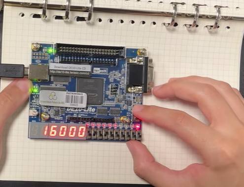 | Etapa 2: [0][1][0][0]<br>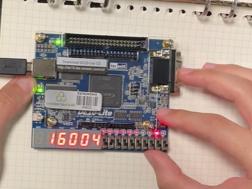 |
| --- | --- |
| Etapa 3: [0][1][1][0][0][0][0][0][0]<br>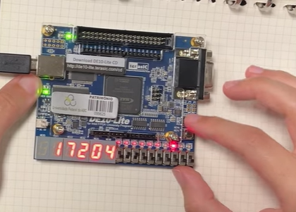 | Etapa 4: [0][0][1][0]<br>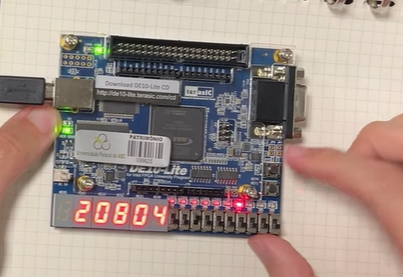 |

**Resultado:** 208 x 2<sup>4</sup> = 3328

CASO 2: Normalização do Bit Mais Significativo (Shift-Left)

**Objetivo:** Provar que após uma subtração que gere "zeros à esquerda", o circuito desloca a fração e ajusta o expoente para garantir que o número fique normalizado (aproveitando os 8 bits).

**Exemplo de operação:** 2304 - 2112 = 192

| Etapa 1: [0][1][0][0][1][0][0][0][0]<br>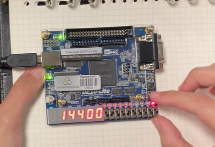 | Etapa 2: [0][1][0][0]<br>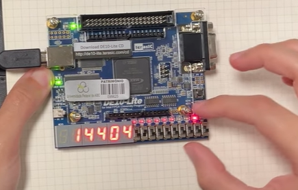 |
| --- | --- |
| Etapa 3: [1][1][0][0][0][0][1][0][0]<br>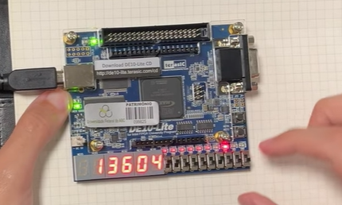 | Etapa 4: [0][1][0][0]<br>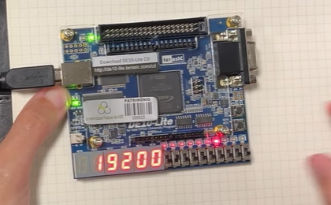 |

**Resultado:** 192 x 2<sup>0</sup> = 192

CASO 3: Underflow (Arredondamento para Zero)

**Objetivo:** Provar a ativação da proteção do sistema elsif (leado \> expb). Acontece quando o resultado de uma subtração é tão pequeno que o circuito não tem expoente suficiente para normalizá-lo.

**Exemplo de operação:** 544 - 520 = 24

| Etapa 1: [0][1][0][0][0][1][0][0][0]<br>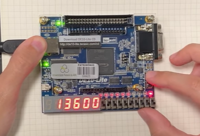 | Etapa 2: [0][0][1][0]<br>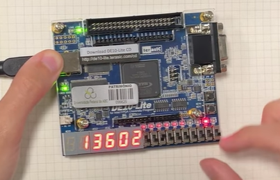 |
| --- | --- |
| Etapa 3: [1][1][0][0][0][0][0][1][0]<br>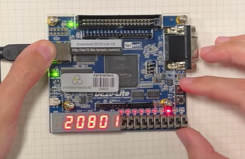 | Etapa 4: [0][0][1][0]<br>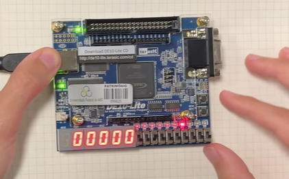 |

**Resultado:** 0 x 2<sup>0</sup> = 0 (como o resultado seria um número peque e para normalizar precisaríamos de um expoente negativo, o resultado dá zero)

CASO 4: Overflow (Estouro da Fração / Carry-out)

**Objetivo:** Mostrar o que acontece quando a soma das frações ultrapassa o limite máximo de 8 bits (255) e exige a correção especial if sum(8) = '1'.

**Exemplo de operação:** 1600 + 1440 = 3040

| Etapa 1: [0][1][1][0][0][1][0][0][0]<br>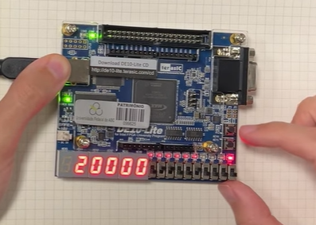 | Etapa 2: [0][0][1][1]<br>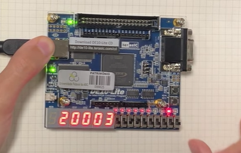 |
| --- | --- |
| Etapa 3: [0][1][0][1][1][0][1][0][0]<br>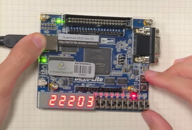 | Etapa 4: [0][0][1][1]<br>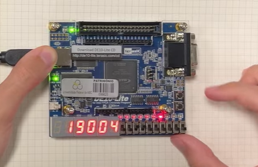 |

**Resultado:** 190 x 2<sup>4</sup> = 3040

*Etapa 4 (considerando que a Etapa 4 é toda a documentação em si)*

## 5. Diário de Bordo de IA

Utilizamos o Gemini e o Claude para auxiliar no entendimento inicial do código, na implementação do uso do clock para utilizarmos o botão como confirmação da inserção de dados e na configuração das saídas para os displays de 7 segmentos. Abaixo está a análise crítica do uso da ferramenta.

**Prompts Utilizados:**

> *Para a saída de dados:  
>   
> Faça a impressão nos visores no formato:*
>
> *Sinal: (0 ou 1) no HEX 0  
> Fracionário: convertido para decimal nos HEX1, 2 e 3  
> Expoente: convertido para decimal nos HEX 4 e 5*
>
> *Para a implementação do clock e o entendimento do código, foram utilizados vários prompts em formato de conversa entre o Gemini (para o entendimento da parte teórica do livro que explicava a implementação) e o Claude (para documentação das linhas de código). Aqui um exemplo:*
>
> *Gere uma documentação completa deste código .vhd (ele é um somador de bits ponto flutuantes usado numa placa). A documentação precisa explicar: input esperado, formato de output, funções, lógica do código e outros tópicos que achar necessário.*
>
> *Utilizamos também o Claude para a criação do testbench final, uma vez que já tínhamos gerado para o código original. O pedido da adaptação foi feito com um prompt simples, fornecendo os códigos do testbench original e o código da placa adaptado.*

**O Erro da IA (Alucinação):**

> *Durante o entendimento do código, a IA (especialmente o Gemini) se atrapalha muito com as conversões entre base 2 e 10 e muitas vezes durante a conversa, ela assume lógicas que fogem da realidade, dando casos de teste com resultados errados. Como o texto inicial cita o formato 0.f, a IA também passou a assumir por várias vezes que estávamos trabalhando somente com números decimais e dava testes complexos que exigiam multiplicações por 100 ou por 255. Nesse caso, precisávamos explicar novamente a lógica que estávamos testando.*
>
> *Durante a implementação da saída, também precisamos reforçar algumas vezes a utilização do display de 7 segmentos, uma vez que a IA tentava utilizar também os leds unitários da placa para a impressão de um binário.*

**A Correção Humana:**

> *Focamos em realizar ajustes e correções durante as aulas em que tínhamos acesso as placas através da análise dos erros gerados entre o versionamento dos códigos, sendo alguns erros identificados durante a compilação e outros diretamente nas saídas das placas.*

## 6. Contribuição dos participantes

- Sofia Bortolazo — Redação do manuscrito original, Redação-revisão e edição,  Análise Formal.

- Camila Lorena — Redação do manuscrito original, Análise Formal, Desenvolvimento, implementação e teste de software.
- Victor Felippe Dias — Redação do manuscrito original, Validação de dados e experimento, Redação-revisão e edição.
